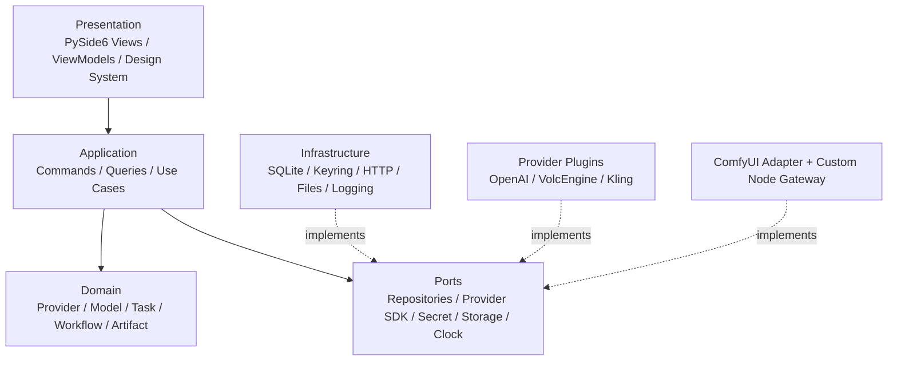

# AstraWeft 架构评审与缺口分析

> 评审基线：[Local AI Workflow Manager Architecture v2](./Local_AI_Workflow_Manager_Architecture_v2.md)  
> 评审结论：总体方向成立，需补齐产品级约束后再编码  
> 日期：2026-07-15

## 1. 执行摘要

v2 明确了 Local First、PySide6、SQLite、Provider 插件化、动态模型 Schema、异步任务、工作流、ComfyUI 和跨平台发布，方向没有根本性问题，不需要推翻。

当前架构属于“正确的产品骨架”，但尚未达到可直接指导长期实现的详细程度。最关键的问题不是少几个页面，而是若按 v2 当前阶段顺序直接开发，会在 Provider、异步任务和插件接口之间形成返工：Phase 3 已要求接入可灵等异步 Provider，Task Manager 和插件机制却分别被放到 Phase 4、Phase 5。它们实际上必须成为更早的基础设施。

建议保留 v2 的模块和产品定位，进行以下结构性补强：

1. 保留单体桌面应用，但采用分层模块化单体，不提前引入微服务。
2. 将 Provider SDK、Task 状态机、密钥存储和数据库迁移前置。
3. 将工作流定义与运行快照分离，保证版本不可变和结果可复现。
4. 用 OS Keychain 代替“数据库内加密 API Key”的模糊方案。
5. 将插件发现、能力协商、协议版本、错误模型和合约测试写成稳定规范。
6. 将 UI 视觉系统与业务组件解耦，先建立 Design System，再开发页面。
7. 在每个阶段加入测试、代码审查、迁移和跨平台门禁，不把质量集中到最后。

## 2. 当前项目状态

### 2.1 已存在

- 项目目录 `AstraWeft/`。
- v2 架构文档以及早期 v1 文档。
- 模块级详细技术设计。
- 数据库 ER 设计。
- GUI 低保真原型设计。
- 空的 `src/astraweft`、`tests`、`plugins` 目录。
- IDE 生成的 `.idea` 本地配置。

### 2.2 尚不存在

- Git 仓库、许可证和开源治理文件。
- `pyproject.toml`、依赖锁定和 Python 包代码。
- CI、代码质量配置、测试或覆盖率基线。
- 可执行应用、数据库或 migration。
- Provider 插件 SDK 与任何真实 Provider。
- UI Design System、图标和可运行页面。
- 打包、签名、公证、升级或发布流水线。

因此当前处于“架构设计阶段”，不是已有代码的重构项目。此时最重要的是统一规格和开发门禁，而不是编写页面 Demo。

## 3. 对 v2 设计的判断

### 3.1 应保持不变的决策

| 决策 | 结论 | 理由 |
|---|---|---|
| Local First | 保留 | 符合创作工具、隐私、易部署定位 |
| PySide6 | 保留 | Python AI 生态友好，能实现现代自定义桌面 UI |
| SQLite + 本地文件 | 保留 | v1 单机可靠、零依赖；搭配 WAL 与 migration 即可 |
| Provider 插件化 | 保留并前置 | 是多服务商和开源生态的核心扩展点 |
| 动态模型 Schema | 保留并标准化 | 避免每个模型硬编码表单 |
| 内置 Task Manager | 保留并增强 | 云端视频/图像任务天然异步 |
| Workflow Manager | 保留 | 是从“API 管理器”升级为“创作基础工具”的关键 |
| ComfyUI 集成 | 保留 | 与本地视觉生成生态形成互补 |
| Dark Cyber AI | 保留 | 产品差异化明确，但必须通过组件系统落地 |
| 跨平台独立包 | 保留 | 符合普通创作者的使用门槛 |

### 3.2 需要澄清而不是推翻的边界

- AstraWeft 是 Provider 治理、任务执行和跨引擎编排中心；ComfyUI 仍是本地节点图与图像处理执行器。
- v1 采用单进程模块化单体；“未来 PostgreSQL/Redis/多 Worker”只通过 Ports 和数据模型保持可迁移性，不在初期实现分布式复杂度。
- Provider 插件是本地可信 Python 代码，不应宣传成安全沙箱。未来若允许任意第三方插件，再增加独立进程隔离。
- v1 工作流只支持 DAG；循环、动态展开、分布式编排不进入首发范围。
- GUI 与 Core 在同一应用进程，但所有网络和磁盘重操作必须离开 UI 主线程。

## 4. 架构缺口与优化建议

### 4.1 开发阶段依赖顺序冲突（高风险）

v2 将真实 Provider 放在 Task Manager 和插件机制之前。可灵视频等接口需要异步提交、轮询、重试、恢复；如果先在具体 Provider 内自行实现，后续抽取统一 Task 会产生重复逻辑和不兼容状态。

优化：先实现 Mock Provider + Provider SDK + Task Runtime，再接真实 Provider。插件机制不是 Phase 5 的包装工作，而是 Phase 1/2 的核心边界。

### 4.2 Task 状态过少（高风险）

`CREATED/RUNNING/SUCCESS/FAILED` 无法表达排队、正在提交、轮询等待、重试等待、取消中、超时、应用重启恢复和远程状态不确定。

优化：引入明确状态机：

```text
CREATED → QUEUED → SUBMITTING → RUNNING/POLLING → SUCCESS
                         ↘ RETRY_WAIT → QUEUED
RUNNING → CANCELING → CANCELED
RUNNING → TIMED_OUT
应用重启 → RECOVERING → POLLING/QUEUED/NEEDS_ATTENTION
```

Task 与 Attempt 分表；所有状态迁移必须由 Domain Policy 校验。

### 4.3 API Key “加密存储”定义不足（高风险）

若加密密钥与数据库放在同一位置，实际安全收益有限；日志、崩溃信息和 Provider SDK 也可能泄露密钥。

优化：默认使用 macOS Keychain、Windows Credential Manager、Linux Secret Service。SQLite 只保存 `credential_ref` 和末四位提示；无系统密钥环时允许会话临时凭据，不默认明文降级。建立统一递归脱敏器。

### 4.4 插件契约缺失（高风险）

`BaseProvider.generate_image()` 不能覆盖模型同步、文本/音频、多模态、同步/异步差异、流式输出、取消、幂等、用量和价格。也没有协议版本或错误语义。

优化：定义稳定 Plugin API：manifest、entry point、能力描述、模型枚举、提交/查询/取消、标准 DTO、错误模型、幂等与重试语义、secret/HTTP 注入、合约测试和兼容策略。详见 Provider 插件接口规范。

### 4.5 动态 Schema 不是标准 JSON Schema（中高风险）

v2 示例中的 `type: select` 是自定义 DSL；长期会导致验证器、GUI 和插件各自解释。

优化：数据验证采用 JSON Schema Draft 2020-12；显示顺序、控件类型、分组和高级字段使用单独 UI Schema。核心不允许远程不受控 `$ref`。

### 4.6 Workflow 可复现性不足（高风险）

只有“模板”和“版本”概念，没有不可变定义、节点端口、运行快照、产物血缘与模型配置快照。Provider 配置或模型 Schema 变化后，历史结果无法解释。

优化：`Workflow → immutable WorkflowVersion → WorkflowRun → NodeRun → Task → Artifact`。发布版本不可修改；运行保存非敏感配置和解析后输入快照；节点图发布前进行 DAG、端口和 Schema 兼容校验。

### 4.7 ComfyUI 集成边界不完整（高风险）

缺少 ComfyUI HTTP/WebSocket 交互、版本兼容、断线恢复、产物下载和 Custom Node 对本地服务的认证方式。

优化：

- Adapter：通过 HTTP 提交 `/prompt`，WebSocket 获取进度，`/history` 获取结果。
- Custom Node Gateway：只监听 `127.0.0.1`，使用随机令牌、请求限制和严格 CORS。
- 将 ComfyUI 当作一种 Execution Adapter，而不是 Provider 的子模块。
- 保存工作流 JSON checksum 与 ComfyUI 版本，便于诊断兼容性。

### 4.8 数据生命周期与迁移不足（高风险）

v2 只有表名，没有主外键、唯一性、索引、迁移、备份、保留期或损坏恢复方案。

优化：SQLAlchemy 2 + Alembic；SQLite 开启外键/WAL/busy timeout；启动迁移前执行 online backup；Request Log 按保留期清理；Artifact 使用相对路径、hash 和回收站。

### 4.9 日志与成本语义不足（中高风险）

请求参数和响应可能含密钥、个人数据或大体积 Base64；成本可能未知、延迟结算或多币种。

优化：业务 Task 与单次 Request Log 分离；正文只保存脱敏摘要；二进制不入库；通过 trace ID 关联；成本用微单位整数 + 币种，未知成本为 NULL 而非 0，并保存计价来源与版本。

### 4.10 UI 现代化不能只靠 QSS（中高风险）

Dark Theme 若在页面完成后再统一，容易形成传统桌面控件拼接感，且难以跨平台一致。

优化：在首个业务页面前建立 Design Token、字体层级、间距、圆角、状态色、按钮、输入、卡片、表格、抽屉、Toast、Skeleton、空态和图标规范。使用自定义组件封装系统差异，保留键盘、屏幕阅读器和高 DPI 支持。

### 4.11 Qt 与异步运行模型未定义（高风险）

Provider SDK 若阻塞主线程，会直接破坏产品体验；多个线程各自访问 SQLite 也可能产生锁问题。

优化：使用 `qasync` 统一 Qt/asyncio；HTTP 使用异步客户端；网络期间不持有数据库事务；所有 ORM Session 有明确作用域；CPU 重任务进入受控线程池/子进程；GUI 只接收 DTO，不持有 ORM 对象。

### 4.12 开源和供应链治理缺失（中高风险）

“支持开源”不仅是上传代码。当前未定义许可证、贡献规则、第三方许可证、插件命名、漏洞报告、版本和发布流程。

优化：编码前确认 License；仓库提供 README、CONTRIBUTING、CODE_OF_CONDUCT、SECURITY、CHANGELOG、插件 SDK 文档；CI 生成 SBOM、依赖许可证清单与哈希；发布包签名并记录可复现构建信息。

### 4.13 跨平台发布细节不足（中风险）

`.exe/.app/binary` 没有覆盖 macOS 签名/公证、Windows 签名、Linux 发行格式、系统 Keychain 差异、高 DPI 和 FFmpeg 等可选依赖。

优化：CI 建立 Windows/macOS/Linux 构建矩阵；将平台能力封装到 Platform Services；首发明确支持的最低系统版本；对外部二进制采用“用户配置路径”或许可证合规的打包方式。

### 4.14 非功能指标与故障策略缺失（中风险）

没有启动时间、列表规模、日志保留、并发、崩溃恢复和无障碍目标，测试难以判断“成熟”。

优化：建立可测 SLO，例如冷启动、页面响应、10 万任务首屏、1000 未完成远程任务恢复、日志无密钥、应用重启不重复计费。

## 5. 产品级模块边界



### 5.1 Presentation

- App Shell、导航、页面、通用组件、主题、图标、无障碍。
- ViewModel 调用 Commands/Queries，订阅 Application Event。
- 不直接导入 SQLAlchemy、httpx 或具体 Provider。

### 5.2 Application

- 用例编排、事务边界、权限/状态前置检查、DTO 映射。
- Commands 负责修改；Queries 负责分页和聚合。
- 不包含具体 Qt 控件和外部 SDK 细节。

### 5.3 Domain

- Provider 配置实体、Model 定义、Task 状态机、Workflow DAG、Artifact 血缘。
- 只依赖 Python 标准库和必要的数据类型抽象。
- 业务规则必须可在无 GUI、无网络、无数据库的单元测试中运行。

### 5.4 Ports / Plugin SDK

- Repository、SecretStore、ArtifactStore、ProviderPlugin、EventBus、Clock。
- Core 对外部世界的稳定边界。
- Provider 插件只使用公开 SDK，不导入 Core 私有模块。

### 5.5 Infrastructure

- SQLite repositories、Alembic、Keyring、httpx、文件存储、日志、平台目录。
- ComfyUI 作为独立 adapter，避免污染 Provider 抽象。

## 6. 风险登记表

| ID | 风险 | 概率 | 影响 | 缓解措施 | 验证点 |
|---|---|---:|---:|---|---|
| R1 | 异步 Provider 重复提交并重复计费 | 中 | 极高 | 稳定幂等键、Attempt、恢复状态 | 强杀故障注入测试 |
| R2 | API Key 出现在 DB/日志/崩溃包 | 中 | 极高 | OS Keychain、统一脱敏、导出复检 | secret canary 扫描 |
| R3 | 插件升级破坏 Core | 高 | 高 | API 版本、能力协商、合约测试 | 多版本兼容矩阵 |
| R4 | UI 因网络/SDK 阻塞冻结 | 中 | 高 | qasync、异步 HTTP、线程边界 | UI 响应性测试 |
| R5 | 工作流升级后历史不可复现 | 高 | 高 | 不可变版本、运行快照、checksum | 历史重放测试 |
| R6 | SQLite 写锁或升级损坏 | 中 | 高 | WAL、短事务、备份、migration 演练 | 压测和升级测试 |
| R7 | ComfyUI 版本差异导致集成失败 | 高 | 中高 | 兼容矩阵、能力探测、诊断信息 | 多版本集成测试 |
| R8 | Dark UI 视觉精致但不可访问 | 中 | 中 | Token、对比度、键盘、高 DPI | 无障碍检查清单 |
| R9 | 三平台打包行为不一致 | 高 | 高 | CI 构建矩阵、平台服务封装 | 干净 VM 冒烟测试 |
| R10 | 产品范围过大导致长期无可用闭环 | 高 | 高 | 垂直切片、每阶段可交付闭环 | 阶段 DoD 审查 |

## 7. 需要在编码前确认的产品决策

以下决策会显著影响实现，建议作为第一阶段评审项，而不是由代码隐式决定：

1. 开源许可证：建议优先评估 Apache-2.0；若希望强制衍生版本开源再评估 GPL/AGPL。
2. 首发平台顺序：建议主开发 macOS，CI 同步覆盖 Windows；Linux 可在首个 beta 前纳入。
3. 首个真实 Provider：建议选择一个同步/简单接口验证基础闭环，再选择可灵或火山视频验证异步任务。
4. 是否首发内置自动更新：建议 v1.0 前提供手动检查更新和签名下载，自动更新在发布链成熟后启用。
5. 插件分发：首发仅支持随应用内置和本地目录安装；插件市场不进入 v1。
6. 诊断数据策略：默认全部本地、遥测关闭；若未来加入匿名遥测必须显式 opt-in。

这些决策不阻塞继续完善文档，但在进入对应实现阶段前必须记录为 ADR。

## 8. 评审结论

v2 架构可以作为产品愿景和高层范围基线，详细技术设计、ER、GUI 原型、Provider 插件规范和实施路线作为可执行补充。建议不修改其核心定位，而是将这些补充文档共同视为 v2.1 工程基线。

在用户确认第一阶段方案前，不进入功能编码。确认后应从仓库治理、工程骨架、Design System 和 Mock Provider 垂直切片开始，而不是直接接三个真实 API 或堆完整页面。
