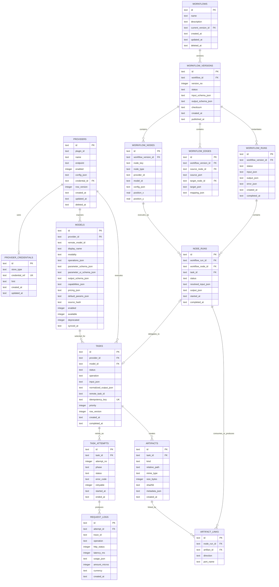

# Local AI Workflow Manager 数据库 ER 设计

> 文档版本：1.0  
> 数据库：SQLite 3（保留迁移到 PostgreSQL 的兼容性）  
> 关联文档：[详细技术设计](./Local_AI_Workflow_Manager_Detailed_Technical_Design.md)
> 实现状态：Provider/Model 与 Task/Attempt/Request Log/Artifact 已落地至 Alembic revision `20260715_0003`；Workflow 相关实体待后续阶段。

## 1. 建模原则

- 本地实体使用 UUID v7 文本主键；Provider 返回的 ID 单独保存。
- 所有时间为 UTC ISO 8601，字段名统一以 `_at` 结尾。
- JSON 字段以 TEXT 存储并在 Application 层用 Pydantic 校验。
- 密钥明文不进入 SQLite；只保存系统 Keychain 引用和脱敏提示。
- 核心业务记录优先软删除；日志和可再生数据按保留策略硬删除。
- 工作流版本发布后不可变，运行实例始终引用确定版本。
- Task 表示一次业务请求，Task Attempt 表示一次具体提交/轮询执行尝试。
- 金额保存为最小货币单位整数 `amount_micros`，并显式保存币种。

## 2. ER 总图



## 3. 表定义

### 3.1 `schema_migrations`

| 字段 | 类型 | 约束 | 说明 |
|---|---|---|---|
| `version` | TEXT | PK | Alembic revision |
| `applied_at` | TEXT | NOT NULL | 应用时间 |
| `app_version` | TEXT | NOT NULL | 执行迁移的应用版本 |

实际可复用 Alembic 自带版本表；这里定义的是产品审计扩展。

### 3.2 `providers`

| 字段 | 类型 | 约束 | 说明 |
|---|---|---|---|
| `id` | TEXT | PK | 本地 Provider 实例 ID |
| `plugin_id` | TEXT | NOT NULL | 插件稳定 ID，如 `org.openai.official` |
| `plugin_version` | TEXT | NOT NULL | 保存时使用的插件版本 |
| `name` | TEXT | NOT NULL | 用户可读名称 |
| `endpoint` | TEXT | NULL | 用户覆盖的 API 地址 |
| `enabled` | INTEGER | NOT NULL DEFAULT 1 | 0/1 |
| `config_json` | TEXT | NOT NULL DEFAULT `{}` | 非敏感配置 |
| `credential_id` | TEXT | FK, NULL | 指向凭据引用 |
| `health_status` | TEXT | NOT NULL | `UNKNOWN/HEALTHY/DEGRADED/UNAVAILABLE` |
| `last_checked_at` | TEXT | NULL | 最近连接测试 |
| `row_version` | INTEGER | NOT NULL DEFAULT 1 | 乐观锁 |
| `created_at` / `updated_at` | TEXT | NOT NULL | 审计时间 |
| `deleted_at` | TEXT | NULL | 软删除 |

约束：活动记录中 `name` 唯一；`plugin_id` 不唯一，允许同一插件配置多个账号或区域。

### 3.3 `provider_credentials`

| 字段 | 类型 | 约束 | 说明 |
|---|---|---|---|
| `id` | TEXT | PK | 凭据元数据 ID |
| `store_type` | TEXT | NOT NULL | `KEYRING/SESSION` |
| `credential_ref` | TEXT | UNIQUE, NOT NULL | Keychain 中的不可逆引用 |
| `credential_type` | TEXT | NOT NULL | `API_KEY/OAUTH2/SERVICE_ACCOUNT` |
| `hint` | TEXT | NULL | 如 `sk-…A7F2` |
| `metadata_json` | TEXT | NOT NULL DEFAULT `{}` | 非敏感 OAuth scope 等 |
| `created_at` / `updated_at` | TEXT | NOT NULL | 审计时间 |

不得添加 `secret`、`api_key`、`access_token` 等明文字段。

### 3.4 `models`

| 字段 | 类型 | 约束 | 说明 |
|---|---|---|---|
| `id` | TEXT | PK | 本地模型 ID |
| `provider_id` | TEXT | FK NOT NULL | 所属 Provider |
| `remote_model_id` | TEXT | NOT NULL | 远端请求使用的 ID |
| `display_name` | TEXT | NOT NULL | 用户可编辑显示名 |
| `modality` | TEXT | NOT NULL | `TEXT/IMAGE/VIDEO/AUDIO/MULTIMODAL` |
| `operations_json` | TEXT | NOT NULL | 插件声明的操作能力集合 |
| `parameter_schema_json` | TEXT | NOT NULL | 输入 JSON Schema |
| `parameter_ui_schema_json` | TEXT | NOT NULL | SchemaForm 展示提示 |
| `output_schema_json` | TEXT | NOT NULL | 标准输出 Schema |
| `capabilities_json` | TEXT | NOT NULL | 流式、取消、批量等能力 |
| `pricing_json` | TEXT | NOT NULL DEFAULT `[]` | 可选价格规则与生效时间 |
| `default_params_json` | TEXT | NOT NULL DEFAULT `{}` | 用户默认参数 |
| `source_hash` | TEXT | NULL | Provider 同步内容摘要 |
| `enabled` | INTEGER | NOT NULL DEFAULT 1 | 用户是否允许新任务使用 |
| `available` | INTEGER | NOT NULL DEFAULT 1 | 最近同步时远端是否存在 |
| `deprecated` | INTEGER | NOT NULL DEFAULT 0 | Provider 是否声明弃用，或远端已消失 |
| `synced_at` | TEXT | NULL | 最近同步时间 |
| `created_at` / `updated_at` | TEXT | NOT NULL | 审计时间 |

唯一约束：`(provider_id, remote_model_id)`。

### 3.5 `tasks`

| 字段 | 类型 | 约束 | 说明 |
|---|---|---|---|
| `id` | TEXT | PK | 本地 Task ID |
| `provider_id` | TEXT | FK NOT NULL | Provider 快照来源 |
| `model_id` | TEXT | FK NULL | 部分 Provider 操作可无模型 |
| `status` | TEXT | NOT NULL | 统一任务状态 |
| `operation` | TEXT | NOT NULL | `generate_image` 等 |
| `input_json` | TEXT | NOT NULL | 已校验的规范化输入 |
| `provider_config_snapshot_json` | TEXT | NOT NULL | 非敏感配置快照 |
| `normalized_output_json` | TEXT | NULL | 标准化结果摘要 |
| `remote_task_id` | TEXT | NULL | 远端 ID |
| `idempotency_key` | TEXT | UNIQUE, NOT NULL | 稳定幂等键 |
| `priority` | INTEGER | NOT NULL DEFAULT 100 | 数值越小优先级越高 |
| `progress` | INTEGER | NULL CHECK 0..100 | 可选进度 |
| `poll_after_at` | TEXT | NULL | 下次允许轮询时间 |
| `timeout_at` | TEXT | NULL | 业务超时点 |
| `cancel_requested_at` | TEXT | NULL | 用户取消意图 |
| `row_version` | INTEGER | NOT NULL DEFAULT 1 | Worker 乐观锁 |
| `created_at` / `updated_at` | TEXT | NOT NULL | 审计时间 |
| `started_at` / `completed_at` | TEXT | NULL | 生命周期时间 |

终态：`SUCCESS/FAILED/CANCELED/TIMED_OUT/NEEDS_ATTENTION`。

### 3.6 `task_attempts`

| 字段 | 类型 | 约束 | 说明 |
|---|---|---|---|
| `id` | TEXT | PK | Attempt ID |
| `task_id` | TEXT | FK NOT NULL | 所属 Task |
| `attempt_no` | INTEGER | NOT NULL | 从 1 递增 |
| `phase` | TEXT | NOT NULL | `SUBMIT/POLL/CANCEL/DOWNLOAD` |
| `status` | TEXT | NOT NULL | `RUNNING/SUCCESS/FAILED` |
| `error_code` | TEXT | NULL | 标准错误码 |
| `error_message` | TEXT | NULL | 已脱敏消息 |
| `provider_error_json` | TEXT | NULL | 已脱敏的原始错误摘要 |
| `retryable` | INTEGER | NULL | 0/1 |
| `retry_after_at` | TEXT | NULL | 计划重试时间 |
| `started_at` / `ended_at` | TEXT | NOT NULL/NULL | Attempt 时间 |

唯一约束：`(task_id, attempt_no, phase)`。

### 3.7 `request_logs`

| 字段 | 类型 | 约束 | 说明 |
|---|---|---|---|
| `id` | TEXT | PK | 请求日志 ID |
| `attempt_id` | TEXT | FK NULL | 连接测试可能无 Attempt |
| `provider_id` / `model_id` | TEXT | FK | 冗余用于高频筛选 |
| `trace_id` | TEXT | NOT NULL | 跨请求追踪 ID |
| `operation` | TEXT | NOT NULL | Provider 操作 |
| `method` | TEXT | NULL | HTTP 方法 |
| `url_template` | TEXT | NULL | 去查询参数和敏感路径后的模板 |
| `http_status` | INTEGER | NULL | 响应码 |
| `latency_ms` | INTEGER | NOT NULL | 耗时 |
| `request_summary_json` | TEXT | NULL | 脱敏摘要 |
| `response_summary_json` | TEXT | NULL | 脱敏摘要 |
| `usage_json` | TEXT | NOT NULL DEFAULT `{}` | token、图片、秒数等 |
| `amount_micros` | INTEGER | NULL | 成本微单位 |
| `currency` | TEXT | NULL | ISO 4217 |
| `error_code` | TEXT | NULL | 标准错误码 |
| `created_at` | TEXT | NOT NULL | 请求完成时间 |

此表按保留期硬删除；删除不影响 Task 事实状态。

### 3.8 `artifacts`

| 字段 | 类型 | 约束 | 说明 |
|---|---|---|---|
| `id` | TEXT | PK | 产物 ID |
| `task_id` | TEXT | FK NULL | 来源 Task |
| `kind` | TEXT | NOT NULL | `IMAGE/VIDEO/AUDIO/TEXT/JSON` |
| `relative_path` | TEXT | UNIQUE, NOT NULL | 相对产物根目录 |
| `mime_type` | TEXT | NOT NULL | MIME |
| `size_bytes` | INTEGER | NOT NULL | 文件大小 |
| `sha256` | TEXT | NOT NULL | 内容校验 |
| `metadata_json` | TEXT | NOT NULL DEFAULT `{}` | 宽高、时长、编码等 |
| `source_url_redacted` | TEXT | NULL | 脱敏来源 |
| `created_at` | TEXT | NOT NULL | 创建时间 |
| `deleted_at` | TEXT | NULL | 进入回收站时间 |

### 3.9 工作流定义表

`workflows` 保存稳定身份，`workflow_versions` 保存不可变定义。

`workflow_versions.status`：`DRAFT/PUBLISHED/ARCHIVED`。同一 Workflow 只允许一个 DRAFT；`(workflow_id, version_no)` 唯一。`checksum` 覆盖输入输出 Schema、节点和边的规范化 JSON，用于导入去重和运行复现。

`workflow_nodes`：

- `node_key` 是版本内稳定的人类可读键。
- `node_type` 为 `PROVIDER_MODEL/COMFYUI/TRANSFORM/CONDITION/APPROVAL`。
- `model_id` 只在 Provider 模型节点中必填。
- `provider_id/model_id` 是定义层软引用，允许跨安装导入后再绑定；发布时由 Domain /
  Application 校验为本机实体。运行态 `tasks` 仍使用严格外键。
- `config_json` 不得包含凭据。
- `(workflow_version_id, node_key)` 唯一。

`workflow_edges`：源/目标节点必须属于同一个版本；禁止自环；DAG 校验由 Domain 层在发布时完成。

### 3.10 工作流运行表

`workflow_runs.status`：`CREATED/RUNNING/WAITING/SUCCESS/FAILED/CANCELED`。

`node_runs.status`：`PENDING/READY/RUNNING/WAITING_APPROVAL/SUCCESS/FAILED/SKIPPED/CANCELED`。唯一约束 `(workflow_run_id, workflow_node_id)`，v1 每个节点每次运行只产生一个 Node Run；节点内部重试由 Task Attempt 表达。

`artifact_links.direction` 为 `INPUT/OUTPUT`，用于追踪产物血缘；唯一约束 `(node_run_id, artifact_id, direction, port_name)`。

### 3.11 `app_settings`

| 字段 | 类型 | 约束 | 说明 |
|---|---|---|---|
| `key` | TEXT | PK | 命名空间键，如 `scheduler.max_concurrency` |
| `value_json` | TEXT | NOT NULL | 已校验 JSON |
| `updated_at` | TEXT | NOT NULL | 更新时间 |

仅存适合事务化查询的设置；窗口几何等纯 GUI 偏好可存 Qt Settings。

## 4. 索引设计

```sql
CREATE INDEX idx_models_provider_enabled
    ON models(provider_id, enabled);

CREATE INDEX idx_tasks_scheduler
    ON tasks(status, poll_after_at, priority, created_at);

CREATE INDEX idx_tasks_provider_created
    ON tasks(provider_id, created_at DESC);

CREATE INDEX idx_tasks_remote
    ON tasks(provider_id, remote_task_id);

CREATE INDEX idx_attempts_task
    ON task_attempts(task_id, attempt_no DESC);

CREATE INDEX idx_request_logs_created
    ON request_logs(created_at DESC);

CREATE INDEX idx_request_logs_provider_created
    ON request_logs(provider_id, created_at DESC);

CREATE INDEX idx_workflow_runs_status_created
    ON workflow_runs(status, created_at DESC);

CREATE INDEX idx_node_runs_run_status
    ON node_runs(workflow_run_id, status);
```

对于软删除唯一性，SQLite 使用 partial unique index：

```sql
CREATE UNIQUE INDEX uq_active_provider_name
    ON providers(name)
    WHERE deleted_at IS NULL;
```

## 5. 删除与引用策略

| 父实体 | 子实体 | 策略 |
|---|---|---|
| Provider | Model、Task | `RESTRICT`；Provider 软删除 |
| Credential | Provider | `SET NULL`，之后由服务清理 Keychain |
| Task | Attempt、Artifact | `RESTRICT`，通过保留策略统一清理 |
| Workflow | Version | `RESTRICT`；Workflow 软删除 |
| Workflow Version | Node、Edge | 草稿可 `CASCADE`，发布版本禁止删除 |
| Workflow Run | Node Run | `CASCADE` 仅用于明确的运行历史清理 |
| Artifact | Artifact Link | `RESTRICT`；先解除血缘引用 |

ORM 不应隐藏级联行为；生产 DDL 中显式定义外键动作。

## 6. SQLite 运行参数

每个连接执行：

```sql
PRAGMA foreign_keys = ON;
PRAGMA journal_mode = WAL;
PRAGMA synchronous = NORMAL;
PRAGMA busy_timeout = 5000;
```

- 写事务保持短小，网络请求期间不得持有事务。
- GUI 查询使用独立只读 Session。
- 定期 checkpoint WAL；不得在任务高峰执行 `VACUUM`。
- 启动时执行快速一致性检查；完整 `integrity_check` 放入维护工具。

## 7. 迁移策略

1. 应用启动时比较代码 Schema revision 与数据库 revision。
2. 升级前通过 SQLite online backup API 创建带时间戳备份。
3. 在单独连接上执行 Alembic migration。
4. 迁移后运行外键检查和关键表计数校验。
5. 失败时保留原库和失败副本，应用进入只读恢复界面。

迁移规则：

- 已发布 migration 不修改，只新增 revision。
- SQLite 删除/改列采用“建新表—复制—校验—替换”。
- JSON 结构升级由带版本号的数据迁移函数完成。
- PostgreSQL 兼容要求：不依赖 SQLite 隐式类型、不使用无替代方案的 SQL。

## 8. 保留、备份与隐私

- Request Log 默认保留 90 天，用户可选 7/30/90/永久。
- Task/Workflow Run 默认永久保留，允许按项目导出后清理。
- Artifact 清理采用“预览影响—进入回收站—延迟硬删除”。
- 自动备份默认保留最近 7 份，备份不包含系统 Keychain 中的秘密。
- 导出数据库前运行脱敏检查，清除请求/响应摘要中插件遗漏的敏感字段。

## 9. 关键查询示例

Dashboard 今日汇总必须按用户时区先计算 UTC 边界：

```sql
SELECT
    COUNT(*) AS task_count,
    SUM(CASE WHEN status = 'SUCCESS' THEN 1 ELSE 0 END) AS success_count,
    SUM(CASE WHEN status IN ('QUEUED','SUBMITTING','RUNNING','POLLING','RETRY_WAIT')
        THEN 1 ELSE 0 END) AS active_count
FROM tasks
WHERE created_at >= :utc_start AND created_at < :utc_end;
```

成本以 Request Log 的已确认用量为准；无价格信息时金额为空而不是 0，避免误导。

## 10. 验收清单

- 外键、唯一约束、CHECK 约束和 partial index 均有自动化测试。
- 10 万 Task、100 万 Request Log 的列表和汇总达到性能目标。
- 进程在提交、保存远程 ID、下载产物等关键点被强杀后可恢复。
- 数据库文件中搜索不到测试 API Key 明文。
- 任一发布版本的 Workflow Run 可还原其节点、参数 Schema 和模型引用。
