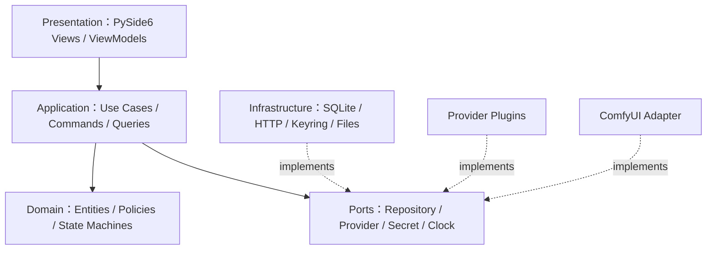
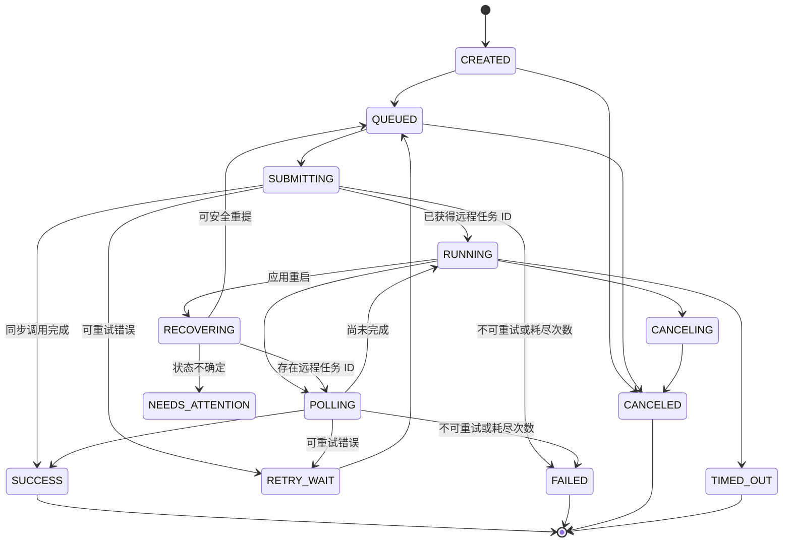

# Local AI Workflow Manager 详细技术设计（模块级）

> 文档版本：1.0  
> 状态：Phase 0–3 已完成本地实现与验收；Phase 4+ 继续作为实现基线  
> 上位文档：[Local_AI_Workflow_Manager_Architecture_v2.md](./Local_AI_Workflow_Manager_Architecture_v2.md)

## 1. 设计目标与边界

### 1.1 目标

- 本地优先：业务数据默认保存在本机，不依赖远程控制面。
- 统一抽象：云端 Provider、ComfyUI 与未来本地模型使用一致的调用、任务和日志模型。
- 插件扩展：新增 Provider 不修改核心业务代码。
- 长任务可靠：支持异步提交、轮询、取消、超时、重试与应用重启恢复。
- 可观测：每次调用可追踪请求、任务、产物、成本和错误链路。
- 单机易部署：首个正式版本使用 SQLite 和单进程桌面应用。

### 1.2 非目标

- v1 不提供多租户、团队权限和云端同步。
- v1 不将工作流定义为通用编程语言；仅支持有向无环图（DAG）。
- v1 不在主进程内执行不受信任的第三方 Python 插件沙箱。
- v1 不替代 ComfyUI 的节点执行引擎；只负责连接、编排和治理。

## 2. 技术基线

| 领域 | 选择 | 说明 |
|---|---|---|
| 运行时 | Python 3.12+ | 类型系统与异步能力成熟 |
| 桌面 GUI | PySide6 6.7+ | Qt 跨平台桌面框架 |
| 异步桥接 | qasync | 统一 Qt 与 `asyncio` 事件循环 |
| HTTP | httpx | 异步、流式上传下载、超时与连接池 |
| 数据模型 | Pydantic v2 | 参数校验、Schema 和插件 DTO |
| ORM | SQLAlchemy 2.x | 支持 SQLite，保留 PostgreSQL 迁移能力 |
| 数据迁移 | Alembic | 显式、可回滚的 Schema 版本管理 |
| 数据库 | SQLite 3，WAL 模式 | 零依赖、适合单机并发读写 |
| 密钥存储 | 系统 Keychain/凭据管理器（keyring） | 数据库仅保存凭据引用 |
| 日志 | 标准 `logging` + JSON formatter | 文件日志与数据库调用日志分离 |
| 打包 | PyInstaller | Windows、macOS、Linux 独立包 |
| 测试 | pytest、pytest-asyncio、pytest-qt | 覆盖核心、异步与 GUI |

版本范围应锁定在 `pyproject.toml`，发布构建使用 lock 文件，避免插件环境随系统 Python 漂移。

## 3. 分层架构



依赖方向固定为外层依赖内层。Domain 不导入 PySide6、SQLAlchemy、httpx 或具体 Provider SDK。

## 4. 代码组织

```text
src/astraweft/
├── bootstrap.py                 # 依赖装配、迁移、恢复任务、启动 UI
├── presentation/
│   ├── main_window.py
│   ├── pages/
│   ├── widgets/
│   ├── viewmodels/
│   └── models/                  # Qt item models
├── application/
│   ├── commands/
│   ├── queries/
│   ├── services/
│   └── dto/
├── domain/
│   ├── provider/
│   ├── model/
│   ├── task/
│   ├── workflow/
│   ├── artifact/
│   └── common/
├── ports/
│   ├── repositories.py
│   ├── provider.py
│   ├── secrets.py
│   ├── event_bus.py
│   └── clock.py
├── infrastructure/
│   ├── database/
│   ├── providers/
│   ├── comfyui/
│   ├── secrets/
│   ├── storage/
│   └── observability/
└── resources/
    ├── migrations/
    ├── icons/
    └── themes/
```

## 5. 公共内核

### 5.1 标识与时间

- 所有主键使用 UUID v7 字符串，便于按时间排序并避免数据库绑定。
- 数据库存储 UTC ISO 8601 时间；GUI 根据系统时区显示。
- 金额使用整数最小单位或 `Decimal` 序列化字符串，禁止浮点累计。
- 外部 Provider 的任务 ID 只作为业务字段，不能作为本地主键。

### 5.2 事务与事件

- 一个 Application command 对应一个数据库事务。
- 事务提交后发布进程内 Domain Event，GUI ViewModel 据此增量刷新。
- 需要可靠恢复的动作必须先持久化任务，再调用外部服务。
- v1 使用进程内事件总线；不得依赖事件总线作为唯一事实来源。

核心事件：

| 事件 | 触发条件 | 主要订阅者 |
|---|---|---|
| `ProviderChanged` | Provider 新增、编辑、启停 | Provider/Model 页面 |
| `TaskStatusChanged` | 任务状态迁移 | Task Center、Dashboard、Workflow Runner |
| `ArtifactCreated` | 产生图片、视频或 JSON | 产物预览、工作流下游节点 |
| `WorkflowRunChanged` | 工作流运行状态变化 | Workflow 页面、Dashboard |
| `RequestLogged` | 一次网络调用结束 | Logs、成本汇总 |

## 6. 模块详细设计

### 6.1 Bootstrap 与生命周期

职责：

1. 解析数据目录和环境覆盖配置。
2. 获取单实例锁；若已有实例则激活原窗口。
3. 初始化结构化文件日志。
4. 打开 SQLite，启用外键与 WAL，执行迁移。
5. 初始化 Secret Store、插件目录和 Provider Registry。
6. 装配 repositories、application services 和 ViewModels。
7. 将遗留 `RUNNING` 任务标记为 `RECOVERING` 并启动恢复。
8. 启动 Qt/qasync 事件循环。

正常退出时停止接收新任务，等待短请求完成；仍在运行的远程长任务保留为可恢复状态，不强制取消。

### 6.2 Config Service

配置优先级：命令行参数 > 环境变量 > 用户配置文件 > 默认值。

配置分类：

- 应用设置：主题、语言、更新通道。
- 运行设置：最大并发、轮询间隔、默认超时、重试策略。
- 存储设置：数据目录、产物目录、日志保留期。
- 网络设置：代理、TLS 验证、可选自定义 CA。

敏感值不得进入配置文件。设置更新通过 `UpdateSettingsCommand` 校验后原子写入临时文件，再替换正式文件。

### 6.3 Provider Manager

职责：

- 发现、加载和校验 Provider 插件。
- 管理 Provider 实例配置与凭据引用。
- 提供连接测试、能力查询和模型同步。
- 根据 `provider_id` 创建带配置快照的 Provider Client。
- 隔离插件异常并转换为标准错误。

关键接口：

```python
class ProviderRegistry(Protocol):
    def list_plugins(self) -> list[ProviderDescriptor]: ...
    def get_plugin(self, plugin_id: str) -> ProviderPlugin: ...

class ProviderService:
    async def create_provider(self, command: CreateProvider) -> ProviderDTO: ...
    async def test_connection(self, provider_id: str) -> HealthCheckDTO: ...
    async def sync_models(self, provider_id: str) -> ModelSyncResultDTO: ...
    async def set_enabled(self, provider_id: str, enabled: bool) -> None: ...
```

连接测试使用独立短超时，不创建业务 Task，但必须写 Request Log。禁用 Provider 后不接受新任务；已提交到远端的任务仍允许轮询完成。

### 6.4 Credential Service

职责：

- 通过系统 Keychain 存储、读取和删除密钥。
- 生成不含密钥的 `credential_ref`。
- 在进程内短暂提供 secret，日志和异常中始终脱敏。

规则：

- 数据库只保存凭据类型、引用和末四位提示。
- API Key 不进入 DTO 的 `repr`、日志上下文或崩溃报告。
- 删除 Provider 时先检查活跃任务；确认删除后清理未被其他配置引用的凭据。
- 无系统 Keychain 时允许用户选择“会话临时凭据”；默认不提供明文落盘回退。

### 6.5 Model Manager

职责：

- 管理本地模型目录及 Provider 模型 ID 映射。
- 存储输入参数 JSON Schema、输出类型、能力和价格信息。
- 验证 Playground/Workflow 节点输入。
- 处理 Provider 同步与用户覆盖字段的合并。

合并原则：Provider 管理字段可被下次同步覆盖；用户字段（显示名、收藏、默认参数、标签）保持不变。Schema 使用 JSON Schema Draft 2020-12，并限制不安全的远程 `$ref`。

### 6.6 Task Manager

Task 是所有 Provider 调用的统一执行记录。状态机如下：



实现组件：

- `TaskService`：创建、重试、取消和查询任务。
- `TaskScheduler`：按优先级和 Provider 并发限制出队。
- `TaskWorker`：执行一次提交或轮询动作。
- `PollingCoordinator`：采用插件建议间隔和指数退避安排轮询。
- `RecoveryService`：应用启动时恢复未完成任务。

并发约束：

- 全局并发上限默认 4。
- 每个 Provider 可配置独立上限，默认 2。
- 同一任务通过数据库乐观版本号避免重复 Worker 执行。
- 用户手动重试创建新的 attempt，但保持同一个本地 task。
- 提交请求必须传递稳定的 idempotency key；不支持幂等键的插件应声明风险。

### 6.7 Workflow Manager

工作流由不可变版本定义。编辑已发布版本时创建草稿副本。

核心对象：

- `Workflow`：名称、描述和当前发布版本。
- `WorkflowVersion`：状态、版本号、输入/输出 Schema。
- `WorkflowNode`：Provider 模型、ComfyUI、转换、条件或人工确认节点。
- `WorkflowEdge`：源输出端口到目标输入端口的映射。
- `WorkflowRun`：一次运行实例。
- `NodeRun`：节点级状态、解析后的输入和对应 Task。

发布校验：

1. 图必须是 DAG。
2. 节点 ID 唯一，边引用的端口存在。
3. 必填输入已绑定工作流输入、常量或上游输出。
4. 上下游 Schema 类型兼容。
5. 所引用 Provider、模型和插件可用。
6. 机密只能通过 Provider 配置引用，不能写入工作流 JSON。

执行器采用拓扑调度。某节点成功后，将标准化输出写成 Artifact，再解析可运行的下游节点。默认失败策略为停止下游；节点可配置有限重试或 `continue_on_error`。

### 6.8 ComfyUI Integration

提供两种适配方式：

- HTTP/WebSocket Adapter：向 ComfyUI `/prompt` 提交工作流，通过 WebSocket 接收进度，从 `/history` 和 `/view` 拉取产物。
- Custom Node：在 ComfyUI 内调用本应用的 loopback API，将云端调用纳入统一密钥、任务和成本管理。

Loopback API 默认绑定 `127.0.0.1`，启动时生成访问令牌；令牌保存在系统 Keychain。所有写操作验证令牌和 `Origin`，不允许默认监听局域网。

### 6.9 Artifact Service

管理生成产物和中间文件：

- 保存图片、视频、音频、文本和 JSON。
- 计算 SHA-256、MIME、大小和尺寸/时长元数据。
- 数据库保存相对路径，产物根目录可迁移。
- 下载先写 `.partial`，校验成功后原子重命名。
- 删除时先检查工作流运行和任务引用，再进入回收站。

建议目录：`artifacts/YYYY/MM/<task_id>/<artifact_id>.<ext>`。

### 6.10 Request Log 与 Observability

一次外部 HTTP 往返对应一条 Request Log；一次业务生成对应一个 Task，可包含多条 Request Log。

记录：trace ID、task/attempt、Provider、模型、操作、状态码、耗时、重试序号、用量、成本和标准错误。请求/响应正文按插件提供的敏感字段规则递归脱敏，二进制正文不入库。

文件日志用于应用诊断并按大小滚动；数据库 Request Log 用于产品内查询和成本统计。两者都不得记录完整密钥、Authorization header、签名串或含密钥 URL。

### 6.11 Query/Reporting Service

所有 Dashboard 与列表页通过只读 Query Service 访问：

- `get_dashboard_summary(range, timezone)`
- `search_tasks(filter, cursor, limit)`
- `search_request_logs(filter, cursor, limit)`
- `get_cost_breakdown(group_by, range)`

列表采用游标分页；大文本只在详情页按需读取。GUI 不直接持有 ORM Session 或惰性加载对象。

### 6.12 GUI Presentation

采用 MVVM：

- View 只负责展示和用户事件。
- ViewModel 调用 command/query，并暴露 loading/data/error 状态。
- Qt item model 管理大列表和分页。
- Domain Event 触发局部刷新，禁止每秒全表查询。

窗口关闭、页面切换不得取消已持久化任务。所有网络操作必须异步执行，主线程中不得调用阻塞 SDK。

## 7. 标准错误模型

```text
AppError
├── ValidationError          # 参数或 Schema 不合法，不重试
├── AuthenticationError      # 凭据无效，不重试
├── PermissionDeniedError    # 权限不足，不重试
├── RateLimitError           # 可按 retry_after 重试
├── ProviderUnavailableError # 服务暂不可用，可重试
├── NetworkError             # 网络错误，可重试
├── ProviderTaskError        # 远端任务明确失败
├── TimeoutError             # 本地等待超时
├── ConflictError            # 版本或状态冲突
└── PluginError              # 插件协议或实现错误
```

错误实例包含 `code`、用户可读消息、技术详情、`retryable`、`retry_after`、Provider 原始错误码和 trace ID。GUI 默认显示用户消息，技术详情在可复制的“诊断信息”中展开。

## 8. 数据一致性与恢复

- SQLite 启用 `PRAGMA foreign_keys=ON`、`journal_mode=WAL`、`busy_timeout=5000`。
- 提交外部请求前持久化 Task 和 Attempt；响应后单事务更新外部 ID、状态与日志关联。
- 若进程在网络提交后、保存远程 ID 前崩溃，恢复时优先使用 idempotency key 查询/重提；无法确认时进入 `NEEDS_ATTENTION`，禁止盲目重复计费。
- 工作流节点只有在 Artifact 持久化完成后才标记成功。
- 数据库备份使用 SQLite online backup API，不能直接复制正在写入的主文件。

## 9. 安全设计

- 密钥默认存系统 Keychain，数据库备份不包含密钥明文。
- Provider endpoint 默认要求 HTTPS；本地地址和明确的开发模式除外。
- 对下载文件限制最大尺寸、MIME 和重定向次数。
- 工作流导入时移除未知字段并进行 Schema、路径穿越和 URL 校验。
- 插件属于本地可信代码，安装前显示来源、版本、权限和校验摘要。
- Loopback API 使用随机令牌、请求体限制、速率限制和严格 CORS。
- 导出诊断包前二次执行统一脱敏器，并向用户展示包含的文件清单。

## 10. 性能目标

| 指标 | v1 目标 |
|---|---|
| 冷启动到主窗口可交互 | ≤ 3 秒（不含首次迁移） |
| 普通页面切换 | ≤ 150 ms |
| 10 万条任务列表首屏 | ≤ 500 ms |
| UI 主线程单次工作 | ≤ 16 ms，严禁网络阻塞 |
| 单实例可管理未完成远程任务 | ≥ 1,000 |
| 请求日志默认保留 | 90 天，可配置 |

## 11. 测试策略

- 单元测试：状态机、重试策略、DAG 校验、Schema 合并、成本计算、脱敏。
- 合约测试：每个 Provider 插件必须通过统一 contract suite。
- 集成测试：临时 SQLite + mock HTTP server，覆盖提交、轮询、取消和恢复。
- GUI 测试：关键 ViewModel 状态和 pytest-qt 冒烟测试。
- 迁移测试：从每个已发布 Schema 版本升级到最新版，并校验回滚/备份策略。
- 故障注入：断网、429、5xx、超时、重复响应、损坏文件、进程重启。

发布门槛：核心单元测试全绿；Provider 合约测试全绿；数据库迁移演练通过；日志抽检无敏感信息。

## 12. 实施顺序

1. 建立 Domain DTO、错误模型、数据库迁移与 repositories。
2. 实现 Secret Store、Provider Registry 和 Mock Provider。
3. 实现 Task 状态机、Scheduler、Worker、恢复与 Request Log。
4. 完成 Provider/Model/Playground/Task/Logs 的最小 GUI 闭环。
5. 接入 OpenAI、火山和可灵插件。
6. 实现 Artifact 与 Workflow DAG 执行。
7. 接入 ComfyUI HTTP/WebSocket 与 Custom Node loopback API。

## 13. 配套文档

- [数据库 ER 设计](./Local_AI_Workflow_Manager_Database_ER_Design.md)
- [GUI 原型设计](./Local_AI_Workflow_Manager_GUI_Prototype_Design.md)
- [Provider 插件接口规范](./Local_AI_Workflow_Manager_Provider_Plugin_Interface_Spec.md)
