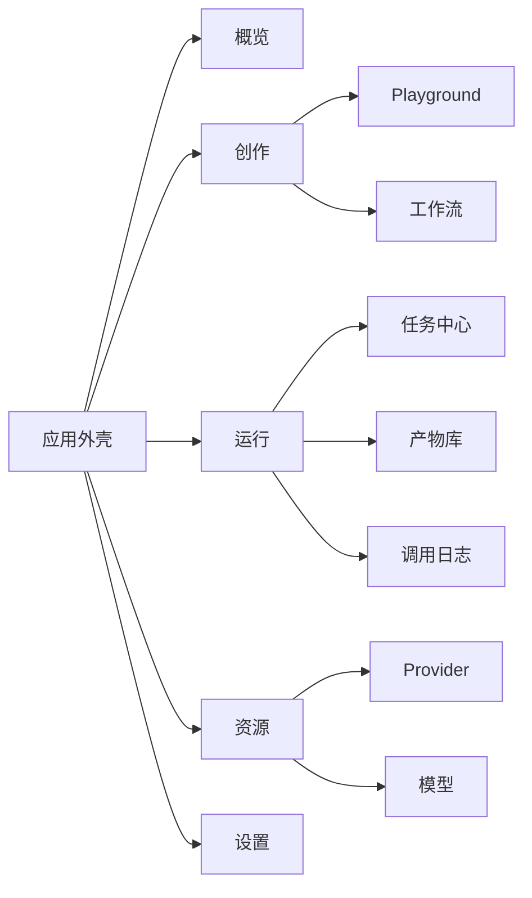

# AstraWeft GUI 原型设计

> 原型级别：模块级低保真，可直接用于 PySide6 实现  
> 默认平台：Windows 11 / macOS，桌面优先  
> 关联文档：[详细技术设计](./Local_AI_Workflow_Manager_Detailed_Technical_Design.md)
> 实现状态：App Shell、Dashboard、Provider、Model、Playground、Task、Log 与 Artifact 页面已通过 Phase 1–3 本地门禁；Workflow 与完整 Settings 待后续阶段。

## 1. 产品体验目标

AstraWeft 是面向 AI 创作者的本地工作台，不是传统 SaaS 管理后台。界面应让用户在一个窗口内完成：配置服务商 → 选择模型 → 试跑 → 观察任务 → 复用为工作流 → 查看产物与成本。

体验原则：

- 创作优先：Playground 和 Workflow 是主工作区，配置与日志是支撑能力。
- 渐进披露：常用参数直接展示，高级参数折叠；技术原始数据放在详情层。
- 状态可信：提交、排队、运行、重试、取消和失败原因必须清晰可见。
- 本地感知：明确显示数据目录、本地 ComfyUI 状态和离线/联网状态。
- 安全默认：密钥永不回显；删除、重复计费风险和导出日志需要明确确认。

## 2. 信息架构



主导航顺序按使用频率排列：

1. 概览
2. Playground
3. 工作流
4. 任务中心
5. 产物库
6. Provider
7. 模型
8. 调用日志
9. 设置

## 3. 应用外壳

### 3.1 主窗口

- 设计基准：1440 × 900。
- 最小窗口：1180 × 720；低于此尺寸不再压缩，允许用户最大化。
- 左侧导航：220 px，支持折叠为 64 px 图标栏。
- 顶部工具栏：56 px。
- 内容区：自适应；表单详情面板建议 360–440 px。
- 底部状态栏：28 px，只显示本地服务、数据库与版本状态。

```text
┌──────────────────────────────────────────────────────────────────────────────┐
│ AstraWeft   [全局搜索 ⌘K________________]       ComfyUI ●  队列 3  [头像/设置] │
├──────────────┬───────────────────────────────────────────────────────────────┤
│ ▣ 概览       │ 页面标题                                    [页面主操作]       │
│ ✦ Playground │ 面包屑 / 可选上下文                                             │
│ ⎇ 工作流     ├───────────────────────────────────────────────────────────────┤
│ ◷ 任务中心  3│                                                               │
│ ◫ 产物库     │                         页面内容                              │
│              │                                                               │
│ ◉ Provider   │                                                               │
│ ◌ 模型       │                                                               │
│ ≡ 调用日志   │                                                               │
│              │                                                               │
│ ⚙ 设置       │                                                               │
├──────────────┴───────────────────────────────────────────────────────────────┤
│ 本地数据库 ● 正常  │ 数据目录 ~/AstraWeft │ v0.1.0                           │
└──────────────────────────────────────────────────────────────────────────────┘
```

### 3.2 全局行为

- `⌘/Ctrl + K`：打开全局命令面板，可跳转页面、打开任务、运行工作流。
- `⌘/Ctrl + ,`：设置。
- `⌘/Ctrl + Enter`：在 Playground 提交。
- `Esc`：关闭最上层抽屉或弹窗，不中断后台任务。
- 右上“队列 N”打开 360 px 任务速览抽屉。
- 所有删除操作使用右下角 Toast 提供有限时间撤销；涉及远程取消或文件硬删除时使用确认框。

### 3.3 视觉与组件基线

建议默认深色主题，提供浅色主题并跟随系统。

| Token | 深色值 | 用途 |
|---|---|---|
| `bg.canvas` | `#0F1115` | 应用背景 |
| `bg.surface` | `#171A21` | 卡片、侧栏 |
| `bg.elevated` | `#20242D` | 弹窗、浮层 |
| `text.primary` | `#F2F4F8` | 主文字 |
| `text.secondary` | `#9CA5B4` | 次级信息 |
| `brand.primary` | `#8B7CFF` | 主操作、选中态 |
| `status.success` | `#35C78A` | 成功 |
| `status.warning` | `#F2B84B` | 等待、降级 |
| `status.danger` | `#F06472` | 失败、危险操作 |
| `status.info` | `#4FA3FF` | 运行、链接 |

字体优先系统 UI 字体；代码、ID 与 JSON 使用等宽字体。正文最小 13 px，主要操作按钮高度 36 px，点击目标不小于 32 × 32 px。

## 4. 首次启动与引导

### 4.1 欢迎页

```text
┌────────────────────────────────────────────────────────────┐
│                        AstraWeft                            │
│               把模型、任务与工作流织在一起                │
│                                                            │
│  [连接第一个 AI Provider]                                  │
│  [连接本地 ComfyUI]                                        │
│  [先进入工作台]                                            │
│                                                            │
│  ✓ 数据保存在本机  ✓ 密钥存入系统钥匙串                    │
└────────────────────────────────────────────────────────────┘
```

引导最多三步，可跳过：

1. 选择 Provider 类型。
2. 填写 Endpoint/区域和凭据并测试连接。
3. 同步模型，选一个默认模型，进入 Playground 发起测试请求。

测试失败保留用户输入并提供“查看诊断”，不强制退出引导。

## 5. Dashboard 概览

### 5.1 页面目的

让用户在 10 秒内知道：服务是否可用、现在有多少任务、今天是否成功、花费多少、最近产物在哪里。

```text
┌ 概览 ──────────────────────────────── 时间范围 [今天⌄] [刷新] ┐
│                                                              │
│ [调用 128 ↑12%] [成功率 96.1%] [预估成本 ¥42.18] [运行中 3] │
│                                                              │
│ ┌ 任务趋势 ──────────────────┐ ┌ Provider 状态 ───────────┐ │
│ │ 成功/失败折线或柱状图       │ │ OpenAI      ● 正常       │ │
│ │                             │ │ 火山        ● 正常       │ │
│ │                             │ │ 可灵        ◐ 限流       │ │
│ └─────────────────────────────┘ └──────────────────────────┘ │
│                                                              │
│ ┌ 正在运行 ───────────────────────────────────────────────┐ │
│ │ 视频生成  68%  可灵  01:42                     [详情]  │ │
│ │ 图片增强  排队  火山   --                        [详情]  │ │
│ └──────────────────────────────────────────────────────────┘ │
│                                                              │
│ ┌ 最近产物 ───────────────────────────────────────────────┐ │
│ │ [缩略图] [缩略图] [缩略图] [缩略图]        [查看全部] │ │
│ └──────────────────────────────────────────────────────────┘ │
└──────────────────────────────────────────────────────────────┘
```

规则：

- 成本未知时显示“¥42.18 + 7 次未计价”，不能把未知计为 0。
- 卡片点击后跳转到带相应筛选条件的列表页。
- Provider 全部不可用时，顶部显示非模态告警条和“检查连接”。
- 无数据时显示开始连接 Provider 或打开 Playground 的引导，不显示空图表。

## 6. Provider 管理

### 6.1 列表页

```text
┌ Provider ────────────────────────────────────── [+ 添加 Provider] ┐
│ [搜索________] [状态：全部⌄] [插件：全部⌄]                       │
│                                                                   │
│ ● OpenAI 主账号     OpenAI   18 个模型   2 分钟前正常   [•••]    │
│ ● 火山华北          火山     12 个模型   5 分钟前正常   [•••]    │
│ ◐ 可灵视频          Kling     4 个模型   限流中          [•••]    │
│ ○ 测试环境          OpenAI    3 个模型   已禁用          [•••]    │
└───────────────────────────────────────────────────────────────────┘
```

行操作：测试连接、同步模型、编辑、启用/禁用、复制配置、删除。单击行打开右侧详情抽屉，双击进入编辑。

### 6.2 新增/编辑 Provider

使用 720 px 对话框或页面级表单：

```text
┌ 添加 Provider ───────────────────────────────────────────┐
│ 1 选择插件  ───  2 配置  ───  3 测试并完成              │
│                                                          │
│ 显示名称 *       [火山主账号____________________]         │
│ API Endpoint      [https://...__________________]         │
│ 区域              [cn-beijing⌄]                           │
│ API Key *         [••••••••••••••••] [替换]              │
│                   密钥将保存到系统钥匙串                 │
│ [高级设置⌄]                                             │
│                                                          │
│ 连接结果：● 成功 · 延迟 182 ms · 账号可用                │
│                                    [取消] [测试连接] [保存]│
└──────────────────────────────────────────────────────────┘
```

交互规则：

- 编辑时永不回填原密钥，只显示已配置和末四位提示。
- “保存”不要求连接测试成功，但必须二次提示 Provider 尚未验证。
- endpoint 非 HTTPS 时显示高风险警告；本机地址例外。
- 禁用仍有活跃远程任务的 Provider 时说明“停止新提交，但继续获取现有任务状态”。

## 7. 模型管理

采用主从布局：左侧 Provider/模态筛选，中间模型表格，右侧详情。

主要列：启用、显示名、远端 ID、类型、Provider、能力、最近同步。详情包含：

- 基本信息与用户标签。
- 参数 Schema 表单预览。
- 默认参数编辑器。
- 输出类型与能力。
- 价格规则及生效时间。
- 原始 Schema（只读 JSON）。

模型同步先展示差异摘要：“新增 3、更新 7、远端删除 1”；远端删除默认标记不可用，不级联删除历史任务。

## 8. Playground

### 8.1 页面布局

```text
┌ Playground ─────────────────────────────────── [保存为模板] ┐
│ Provider [火山主账号⌄]   模型 [Seedream 4.0⌄]  ● 可用       │
├──────────────────────────────┬──────────────────────────────┤
│ 输入                         │ 结果                         │
│ Prompt *                     │ ┌──────────────────────────┐ │
│ [__________________________] │ │                          │ │
│ [__________________________] │ │    图片/视频/文本预览     │ │
│                              │ │                          │ │
│ 尺寸 [1024×1024⌄]            │ └──────────────────────────┘ │
│ Seed [随机____________]       │ 状态：成功 · 8.2s · ¥0.12   │
│ 数量 [1 ──●──── 4]           │ [打开文件夹] [复制结果]     │
│                              │                              │
│ [高级参数⌄]                  │ [请求] [响应] [调用日志]    │
│                              │                              │
│ [重置]              [生成 ⌘↵]│                              │
├──────────────────────────────┴──────────────────────────────┤
│ 历史： [缩略图 10:42] [失败 10:38] [视频 10:31]            │
└─────────────────────────────────────────────────────────────┘
```

### 8.2 Schema 驱动控件映射

| JSON Schema | GUI 控件 |
|---|---|
| `string` | 单行输入；`format=textarea` 为多行 |
| `enum` | 下拉或 ≤5 项单选 |
| `boolean` | Switch |
| `integer/number` + min/max | SpinBox 或 Slider + 数值输入 |
| `array` | 可增删的重复项列表 |
| 文件/图片格式 | 文件选择器、拖放区和缩略图 |
| `oneOf` | 模式切换后显示对应字段组 |
| object | 分组卡片，可折叠高级字段 |

提交前即时校验；错误显示在字段下方并把焦点移到首个错误。同步请求显示取消等待，异步任务提交成功后结果区立即切换到进度卡，不冻结页面。

### 8.3 历史与复现

- 历史条目只保存已脱敏参数。
- “再次运行”先载入参数，不立即计费。
- 若原模型不可用，显示替换模型选择和参数兼容差异。
- “转为工作流”创建包含一个 Provider 节点的草稿。

## 9. 任务中心

### 9.1 列表

```text
┌ 任务中心 ───────────────────────────────────── [暂停新任务] ┐
│ [全部 248] [运行中 3] [排队 5] [失败 7] [需处理 1]         │
│ [搜索 ID/模型] [Provider⌄] [时间⌄] [清除筛选]              │
│                                                               │
│ □ 状态     任务/模型          Provider  进度  耗时  创建时间 │
│ □ 运行中   视频生成/Kling 2.1 可灵      68%   1:42  10:42   │
│ □ 重试中   图片生成/Seedream  火山      --    0:18  10:41   │
│ □ 失败     音频合成/TTS       OpenAI    --    0:04  10:38   │
│                                                               │
│                                               [1 2 3 … 下一页]│
└───────────────────────────────────────────────────────────────┘
```

状态使用图标 + 文字 + 颜色，不能只用颜色。运行中行显示线性进度；无准确进度时使用活动指示器并显示已耗时。

### 9.2 任务详情抽屉

抽屉宽 440 px：

- 顶部：状态、任务名、本地 ID、远端 ID、复制按钮。
- 进度：创建、提交、运行、下载、完成的时间线。
- 基本信息：Provider、模型、工作流/节点来源、超时。
- 输入：脱敏且可折叠的结构化参数。
- 输出：产物卡和规范化 JSON。
- Attempts：每次提交/轮询/取消及错误。
- 操作：取消、重试、在 Playground 打开、查看日志。

失败时首屏显示可理解的原因和建议动作；技术栈、原始响应放在“诊断信息”。对状态不确定的任务，将“重新提交（可能重复计费）”与“仅查询远程状态”明确分开。

## 10. 工作流

### 10.1 工作流列表

卡片/表格可切换，显示名称、当前版本、节点数、最近运行、成功率和标签。主操作：新建空白、从模板创建、导入、打开最近草稿。

### 10.2 编辑器

```text
┌ 角色短视频 v3（草稿） ───────── [验证] [试运行] [发布] ┐
├──────────────┬───────────────────────────────┬──────────┤
│ 节点库       │ 画布                          │ 属性     │
│ 搜索节点     │                               │ 节点名称 │
│              │ [工作流输入]                  │ 模型     │
│ Provider     │       │                       │ 参数     │
│ □ 图片生成   │       ▼                       │ 输入映射 │
│ □ 视频生成   │ [角色图生成] ──▶ [图片增强]   │ 重试策略 │
│ ComfyUI      │                       │       │          │
│ □ 本地工作流 │                       ▼       │          │
│ 控制         │                  [视频生成]    │          │
│ □ 条件       │                       │       │          │
│ □ 人工确认   │                       ▼       │          │
│              │                 [工作流输出]   │          │
├──────────────┴───────────────────────────────┴──────────┤
│ 问题 2：图片增强.output 与视频生成.image 类型兼容 ✓     │
└──────────────────────────────────────────────────────────┘
```

画布交互：

- 从节点库拖入；端口拖线连接；空格拖动画布；滚轮缩放。
- 选中节点在右侧编辑，表单由模型 Schema 生成。
- 删除节点前预览受影响的边。
- 自动保存草稿，标题显示“保存中/已保存/保存失败”。
- `验证` 在底部问题面板按错误/警告列出，并能定位节点。
- `发布` 创建不可变版本；发布后编辑自动创建新草稿。
- `试运行` 从右侧打开运行配置，支持只运行到选定节点。

### 10.3 运行观察模式

运行时不覆盖编辑状态；画布节点显示 `等待/运行/成功/失败/跳过`。点击节点展示本次 Node Run 的输入、Task、日志和产物。人工确认节点通过系统通知和页面横幅提醒。

## 11. 产物库

支持网格与列表视图，按类型、Provider、模型、工作流、日期和标签筛选。

产物卡：缩略图、类型、尺寸/时长、创建时间、来源任务。详情面板提供预览、元数据、来源血缘、打开文件夹、复制路径、在 Playground 使用、加入工作流输入和移入回收站。

本地文件缺失时显示“文件已在外部移动”，允许重新定位或只删除记录。视频预览默认不自动播放。

## 12. 调用日志

### 12.1 列表与详情

主要列：时间、Provider、模型、操作、结果、HTTP 状态、耗时、成本、trace ID。

详情采用标签页：

- 概要：时间、耗时、关联 Task/Attempt、标准错误。
- 请求：已脱敏 headers 和 body 摘要。
- 响应：已脱敏 status、headers 和 body 摘要。
- 用量/成本：计价单位、数量、单价来源和币种。
- 诊断：插件版本、重试次数、trace ID，可复制。

“导出日志”默认只导出筛选结果且再次运行脱敏。若用户选择包含原始正文，界面明确列出风险和包含字段。

## 13. 设置

分区：

- 常规：主题、语言、开机行为、更新。
- 任务：全局/Provider 并发、默认超时、重试、轮询。
- 存储：数据目录、产物目录、缓存、回收站。
- ComfyUI：地址、连接测试、默认工作流目录、loopback token 重置。
- 网络：代理、TLS、CA。
- 隐私与日志：保留期、诊断包、清理历史。
- 插件：已安装插件、版本、来源、权限、启用状态。
- 关于：版本、许可证、数据位置。

更改数据目录必须通过迁移向导执行：空间检查 → 暂停写入 → 复制与校验 → 切换 → 可选清理旧目录。

## 14. 统一状态设计

每个数据页面必须实现以下五态：

| 状态 | 表现 | 可用操作 |
|---|---|---|
| Initial | 首次访问骨架屏 | 无 |
| Loading | 保留旧数据并显示小型刷新指示 | 可取消长查询 |
| Empty | 说明原因 + 一个主操作 | 创建/清除筛选 |
| Error | 用户消息 + trace ID 折叠区 | 重试/诊断 |
| Ready | 数据、更新时间、可刷新 | 页面正常操作 |

Toast 用于轻量成功/失败反馈；需要用户决策的错误使用页面内提示或对话框。后台任务失败不得用阻塞弹窗打断当前创作。

## 15. 可访问性与本地化

- 键盘可到达全部操作，焦点样式清晰，焦点顺序与视觉顺序一致。
- 状态同时使用颜色、图标和文字。
- 正文对比度目标 WCAG AA；图标按钮提供 accessible name 和 Tooltip。
- 支持系统字体放大至 125% 不截断关键操作。
- 中文为首发语言；布局预留英文增长空间，避免固定文本宽度。
- 时间、数字、货币由 locale 格式化；日志中的原始 UTC 可复制。
- 动画遵循系统“减少动态效果”设置。

## 16. 高风险操作确认文案

### 取消远程任务

标题：取消这个任务？  
正文：将向 Provider 请求取消。部分服务可能已经产生费用，且取消不一定立即生效。  
操作：`继续运行` / `取消任务`

### 不确定状态下重新提交

标题：可能产生重复任务  
正文：AstraWeft 无法确认上次提交是否被 Provider 接收。重新提交可能再次计费。建议先查询远程状态。  
操作：`返回` / `仅查询状态` / `仍然重新提交`

### 删除 Provider

正文必须展示关联的模型数、未完成任务数和工作流引用数。有活跃任务时禁止直接删除，只允许禁用。

## 17. MVP 页面优先级

| 优先级 | 页面/能力 | 验收重点 |
|---|---|---|
| P0 | 应用外壳、Provider、模型、Playground | 完成首次调用闭环 |
| P0 | 任务中心、任务详情、调用日志 | 可追踪异步任务和错误 |
| P1 | Dashboard、产物库 | 运营概览与结果复用 |
| P1 | 工作流列表、画布、运行观察 | 完成多节点编排闭环 |
| P2 | 插件管理、数据迁移向导 | 扩展和运维体验 |

## 18. 原型验收场景

1. 新用户在 3 分钟内添加 Provider、测试连接并完成一次图片生成。
2. 用户能在任务中心解释一个失败任务发生在哪个阶段，并找到可执行的下一步。
3. 用户从一次成功的 Playground 调用创建单节点工作流，再增加 ComfyUI 节点并发布。
4. 应用重启后，用户能看到远程视频任务继续轮询，页面无重复任务。
5. 用户能从产物反查工作流运行、节点、Task 和 Request Log。
6. 用户在任何页面都看不到完整 API Key，导出的普通日志不含秘密。
