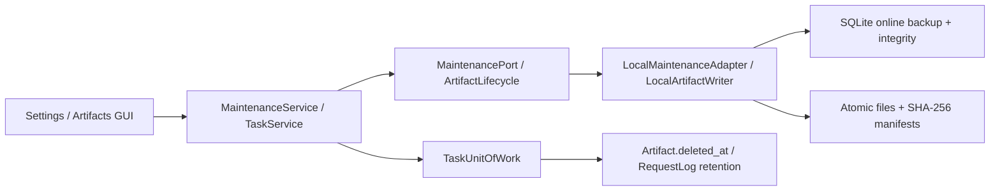
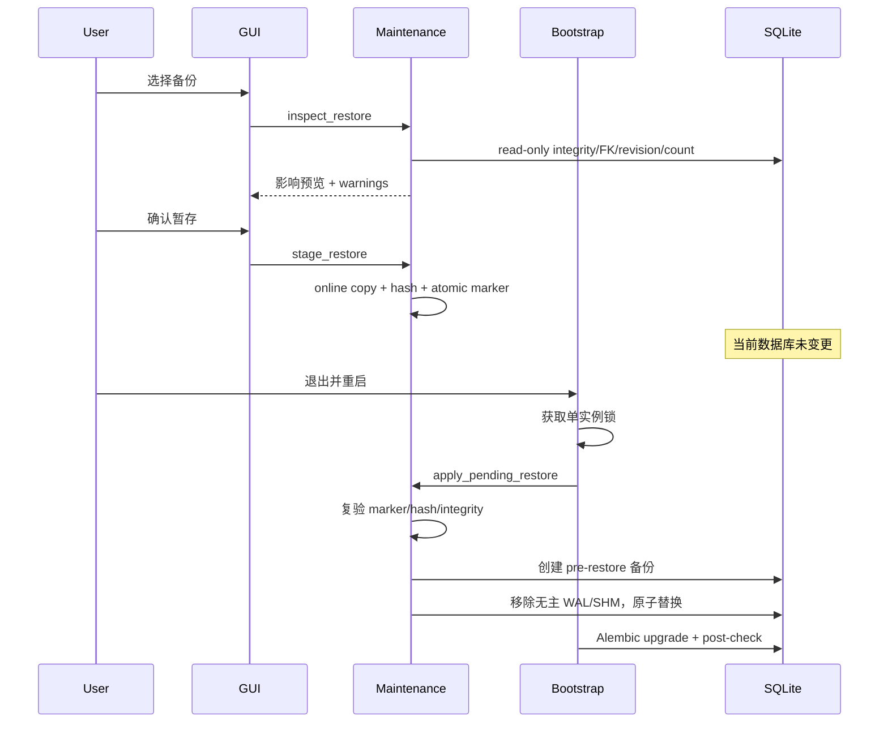

# AstraWeft 本地数据维护实施设计

- 阶段：Phase 7
- 状态：Implemented Slice 1
- 日期：2026-07-15
- 决策基线：ADR-003、ADR-009、ADR-013

## 1. 目标与非目标

本模块提供本地数据库健康检查、在线备份、分阶段恢复、数据目录迁移、
Artifact 回收站、保留策略与脱敏诊断包。不实现云备份、跨设备同步、任意 SQL 导出、
在线热替换数据库或自动删除旧数据目录。

## 2. 模块边界

- Presentation 只显示影响预览并调用 async Application Service。
- Application 定义命令顺序、确认条件与尽力回退，不导入 SQLite、ZIP 或 Qt。
- Infrastructure 实现 SQLite snapshot、文件移动、hash、manifest、ZIP 和平台路径。
- 运行时 SQLite 操作通过 `asyncio.to_thread` 离开 GUI event loop。

## 3. 路径布局

| 路径 | 用途 |
|---|---|
| `data/astraweft.db` | 主数据库 |
| `data/backups/*.db + *.json` | 已校验备份与无敏感元数据 |
| `data/restore.pending.db` | 已二次检查的待恢复快照 |
| `data/restore.pending.json` | 恢复 hash/revision/staged filename marker |
| `data/trash/artifacts/<id>/<name>` | 可恢复产物文件 |
| `data/diagnostics/*.zip` | 脱敏诊断包 |
| `<target>/migration.complete.json` | 数据迁移完成证据 |
| `.<target>.astraweft-partial-*` | 未发布迁移目录/失败证据 |

## 4. 备份与启动升级

1. SQLite source connection 在 WAL 模式下使用 `Connection.backup` 写入同目录 temporary DB。
2. temporary DB 通过 integrity、FK、revision 和表计数检查。
3. 计算 SHA-256、设置私有权限并原子 replace 为最终 `.db`，再写入 JSON manifest。
4. 根据 `backup_retention_count` 保留最近 N 份 DB/manifest 对。
5. 启动时如现有 revision 与 bundled head 不同，Alembic upgrade 之前自动创建
   `pre-migration` 备份；升级后再次校验数据库。

## 5. 恢复时序

新版本创建的备份、无 revision 文件、损坏 SQLite、FK 违规或 hash 不匹配都不可
暂存/应用。旧 revision 可暂存，在原子恢复后进入正常 Alembic upgrade。

## 6. 数据目录迁移

- 预览检查目标是否位于源目录内、是否为空、需求字节和可用空间。
- 迁移 config/data/logs；不迁移 cache、实例锁、WAL/SHM、pending restore 或符号链接。
- 主数据库使用 online backup，其余文件复制后逐一写入 size/SHA-256 manifest。
- 任何中断只影响隐藏 partial 目录，不会出现名为正式目标的半成品。
- 发布后源目录保留。目标可通过 `astraweft --data-dir <target>` 独立启动验证；
  无人值守自动切换在 Phase 7 后续启动器任务中完成。

## 7. Artifact 回收站与保留

| 操作 | 文件 | 数据库 | 限制/回退 |
|---|---|---|---|
| 预览 | 检查 active/trash 文件 | 读 Task 和 Workflow 引用计数 | 无写入 |
| 移入回收站 | 原子 move 到 trash | 设置 `deleted_at` | DB 失败时尽力移回 |
| 恢复 | 原子 move 回原路径 | 清除 `deleted_at` | 同名冲突禁止覆盖 |
| 永久删除 | 删除 trash 文件 | 删 Artifact row | 要求已删除、hash 确认、无 Workflow 引用 |

应用启动按 `artifact_trash_retention_days` 清理超期且可永久删除的产物。
Request Log 按 7/30/90 天或 `0 = 永久保留` 执行硬删除。

## 8. 诊断包隐私契约

ZIP 仅包含：

- `manifest.json`：格式、创建时间、应用版本和隐私说明。
- `runtime.json`：OS/架构/Python，不包含用户名和绝对路径。
- `settings.redacted.json`：非 Secret 设置且重新递归脱敏。
- `database-health.json`：revision、integrity、FK 数量、表行数，不包含 row 内容。
- `logs/*.redacted.jsonl`：每个最多取最近 2 MiB，解析 JSON 后再递归脱敏；非 JSON 行也执行
  Bearer 脱敏。

## 9. 故障注入与验收

已覆盖：备份保留、manifest/hash、恢复前后数据差异、pending 篡改、损坏 marker、
无 revision/新版 revision/旧版 revision、二次脱敏、迁移成功、目标冲突、复制中断、
回收站恢复/冲突/缺文件/确认删除、保留周期和 GUI 影响预览。

本切片通过时的全量基线为 363 项测试、90.54% branch coverage；最终 Phase 7 数字以
阶段验收报告为准。
